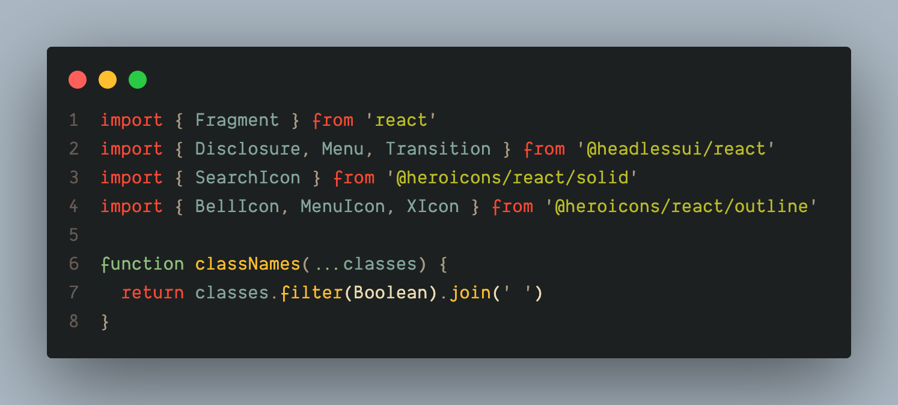
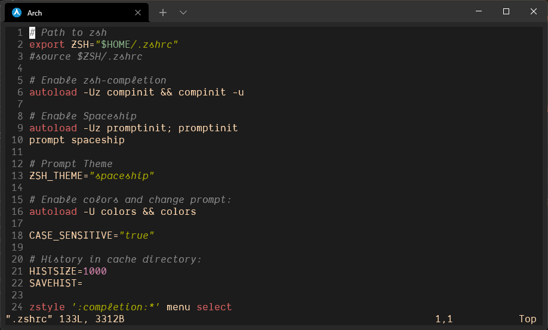
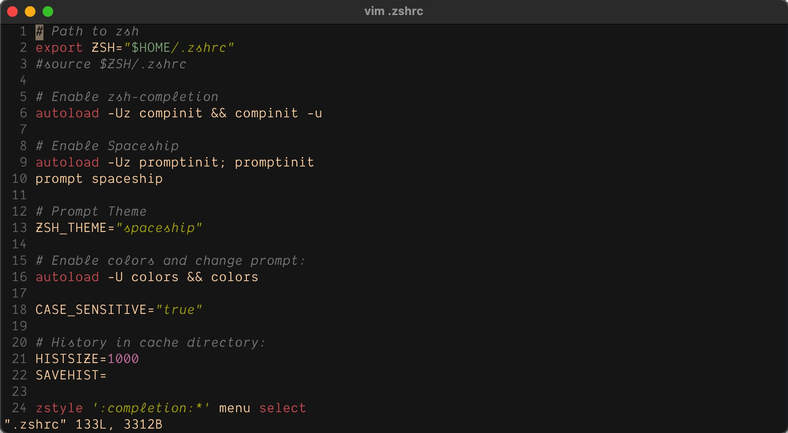

# Dotfiles

## Table of Contents

- [Setup](#setup)
- [Arch Linux](#arch-linux)
- [MacOS](#macos)
- [Windows](#windows)

## Setup

The setup process is as follows:

- Clone the repository to your local machine.

```sh
git clone https://github.com/Somdobomk/dotfiles.git ~/dotfiles
cd ~/dotfiles
```

(Or, [fork and keep your fork
updated](./Fork.md))

## Screenshots

## VS Code



## Vim Gruvbox

|  |  |
| :-: | :-: |
| Arch | MacOS |

## Fonts

- [Dank Mono](https://philpl.gumroad.com/l/dank-mono)
- [Skribble Mono](https://www.skribble.dev/)
- [Victor Mono](https://rubjo.github.io/victor-mono/)

## [MacOS](https://www.apple.com/osx/)

### [Homebrew](https://brew.sh/)

- [Mas](https://github.com/mas-cli/mas)
- [Hyper Terminal](https://aur.archlinux.org/packages/hyper)
- [Fig](https://fig.io/)
- [Git](https://git-scm.com/)
- [Vim](https://www.vim.org/)
  - [Gruvbox Theme](https://github.com/morhetz/gruvbox)
- [Starship Prompt](https://starship.rs/)
- [Zoxide](https://github.com/ajeetdsouza/zoxide)
- [Zsh-autosuggestions](https://github.com/zsh-users/zsh-autosuggestions)
- [Zsh-syntax-highlighting](https://github.com/zsh-users/zsh-syntax-highlighting)

```sh
brew install mas hyper fig git vim starship zoxide zsh-autosuggestions zsh-syntax-highlighting
```

## [Windows](https://www.microsoft.com/en-us/windows/)

- [Winget](https://github.com/microsoft/winget-cli) (Windows Package Manager Client)
- [Scoop]([https://](https://github.com/ScoopInstaller/Scoop)) (Command-line installer)

## Install WSL

```sh
wsl --install
```

Check version of WSL with the command:

```sh
wsl -l -v
```

## Upgrading to WSL 2

[WSL 2](https://learn.microsoft.com/en-us/windows/wsl/install-manual#step-4---download-the-linux-kernel-update-package)

Make all future WSL machines WSL 2

```sh
wsl --set-default-version 2
```

## Installing [Arch Linux](https://archlinux.org/) under WSL

### Basic Installation

Download [ArchWSL](https://github.com/yuk7/ArchWSL) install zip, pick a folder (for example, 'C:\Program Files\ArchWSL') and run `ArchWSL.exe`

### Initalize Pacman

Refresh Pacman GPG keys

```sh
pacman-key --init
pacman-key --populate archlinux
pacman-key --refresh-keys
pacman -Sy archlinux-keyring
```

Update all packages to latest version with:

```sh
pacman -Syyu
```

### Install ZSH and make default shell

```sh
pacman -S zsh
zsh
chsh -s $(which zsh)
```

### Create a user

- Add a sudo group: `sudo groupadd sudo`
- Enable sudoers: `vim /etc/sudoers` and uncomment lines `%wheel ALL=(ALL) ALL` and `%sudo ALL=(ALL) ALL`
- Add a new admin user: `useradd -m -G wheel,sudo -s /bin/zsh <username>`
- Set password for the new user: `passwd <username>`
- Open Windows command shell, go to the directory where you extracted Arch Linux, run `Arch.exe config --default-user <username>`
- Now you have a new user with basic Arch Linux configured

## Pacman Animation

Edit pacman.conf

```sh
sudo vim /etc/pacman.conf
```

Replace the contents of the file with the following to enable pacman animations and the multilib

```sh
[options]
HoldPkg     = pacman glibc
Architecture = auto
IgnorePkg   = fakeroot
Color
TotalDownload
CheckSpace
VerbosePkgLists
ILoveCandy
SigLevel    = Required DatabaseOptional
LocalFileSigLevel = Optional

[core]
Include = /etc/pacman.d/mirrorlist

[extra]
Include = /etc/pacman.d/mirrorlist

[community]
Include = /etc/pacman.d/mirrorlist

[multilib]
Include = /etc/pacman.d/mirrorlist
```

Save, exit, and update the package database

```sh
sudo pacman -Syyu
```

### Install AUR helper ([Paru](https://aur.archlinux.org/packages/paru-git))

```sh
sudo pacman -S --needed base-devel
git clone https://aur.archlinux.org/paru.git
cd paru
makepkg -sic
```

## Packages

- [Gruvbox Theme](https://github.com/morhetz/gruvbox)
- [Hyper Terminal](https://aur.archlinux.org/packages/hyper)
- [Reflector](https://wiki.archlinux.org/title/Reflector)
- [Starship Prompt](https://starship.rs/)
- [Vim](https://www.vim.org/)
- [Visual Studio Code](https://code.visualstudio.com)
- [Zoxide](https://archlinux.org/packages/community/x86_64/zoxide/)
- [Zsh-autosuggestions](https://github.com/zsh-users/zsh-autosuggestions)
- [Zsh-syntax-highlighting](https://github.com/zsh-users/zsh-syntax-highlighting)

### How to sort and rate the 10 fastest mirrors closest to you

- Visit [Pacman Mirrorlist Generator](https://archlinux.org/mirrorlist/)
- Select your country and click `Generate List`
- Copy the whole page that is generated

```sh
sudo vim /etc/pacman.d/mirrorlist
```

- Erase the file contents and paste the generated list
- Save and Exit vim
- Run the following command to generate the mirror list from the source and then update the package database.

```sh
sudo reflector --latest 10 --sort rate --save /etc/pacman.d/mirrorlist
sudo pacman -Syyu
```

### Keep ssh keys from Windows

If you had ssh setup in Windows and want to keep the same ssh keys do the following:

- Copy .ssh from Windows to Linux home directory:

```sh
chmod 0644 .ssh/id_rsa.pub
chmod 0600 .ssh/id_rsa
```

## Set Arch Linux as the default WSL

```sh
wsl --set-default Arch
```

## Run Linux GUI apps in WSL

[WSL2 Docs](https://docs.microsoft.com/en-us/windows/wsl/tutorials/gui-apps?WT.mc_id=windows-c9-niner#install-support-for-linux-gui-apps)

## Backing up and importing to WSL

```sh
wsl --export <distro> <filename.tar>
wsl --import <distro> <install location> <filename>
```

## How to map a drive from Windows to your Linux subsystem

- Open Windows Explorer
- Click the `...` toolbar and choose `Map network drive`
- If the `Map network drive` menu option is missing make sure `This PC` is highlighted on the left hand side of the Explorer Window
- Enter the share; all available Linux subsystems will be uner the `\wsl$` share followed by the operating system

```sh
\\wsl$\Arch
```

## How to completely remove a Linux distro from WSL

- Open up PowerShell
- To get the exact name for the distro you want

```sh
wsl -l -v
wsl --unregister <distro name>
```
