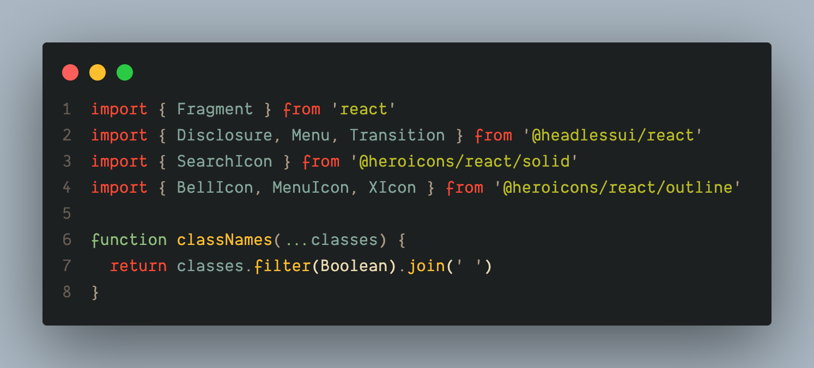
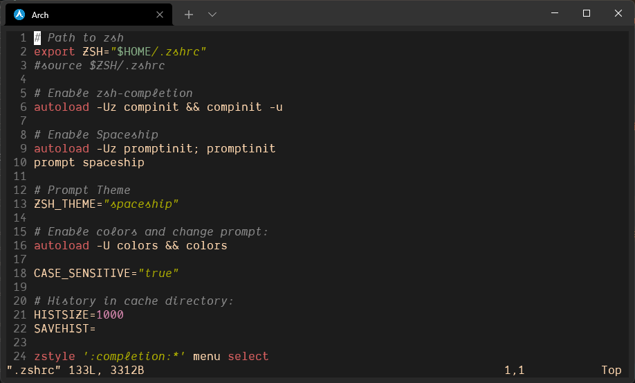
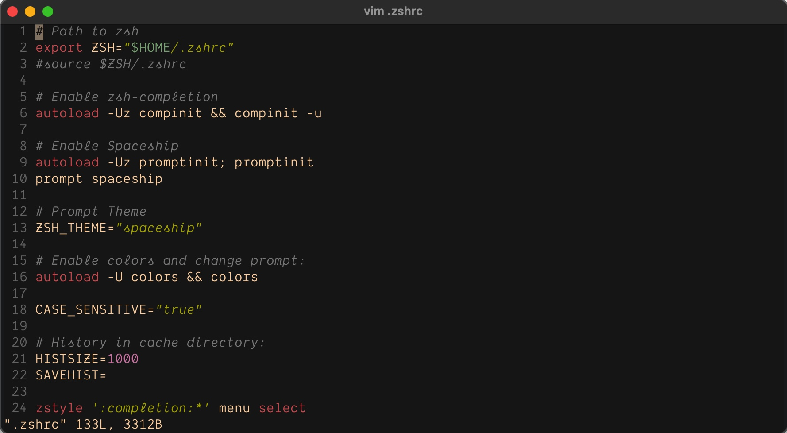
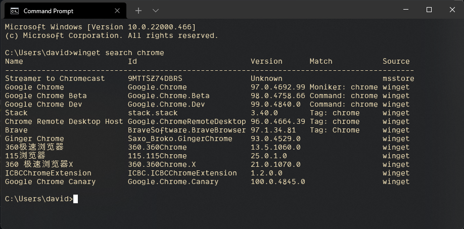

# Dotfiles

## Table of Contents

- [Setup](#setup)
- [Arch Linux](#arch-linux)
- [MacOS](#macos)
- [Windows](#windows)

## Setup

The setup process is as follows:

- Clone the repository to your local machine.

```sh
git clone https://github.com/Somdobomk/dotfiles.git ~/Dotfiles
cd ~/Dotfiles
```

(Or, [fork and keep your fork
updated](./Fork.md))

## Screenshots

## VS Code



## Vim Gruvbox

|  |  |
| :-: | :-: |
| Arch | MacOS |

## Customize

### Font

- [Dank Mono](https://philpl.gumroad.com/l/dank-mono)
- [Victor Mono](https://rubjo.github.io/victor-mono/)

## [Arch Linux](https://wiki.archlinux.org)

### Pacman Animation

- Edit pacman.conf with  `sudo vim /etc/pacman.conf`
- Go to the section `#Misc options` and add `ILoveCandy`
- Save and exit

### Packages

- [Yay](https://aur.archlinux.org/packages/yay/)
- [Kitty Terminal](https://aur.archlinux.org/packages/kitty-git/) `pacman -S kitty`
- [Git](https://git-scm.com/) `pacman -S git`
- [GNU Stow](https://www.gnu.org/software/stow/) `pacman -S stow`
- [Vim](https://www.vim.org/) `pacman -S vim`
  - [Gruvbox Theme](https://github.com/morhetz/gruvbox)
- [Zsh](https://www.zsh.org/) `pacman -S zsh`
  - [Spaceship Prompt](https://github.com/spaceship-prompt/spaceship-prompt) `yay spaceship-prompt`
  - [Zsh-autojump](https://github.com/wting/autojump)
  - [Zsh-autosuggestions](https://github.com/zsh-users/zsh-autosuggestions)
  - [Zsh-syntax-highlighting](https://github.com/zsh-users/zsh-syntax-highlighting)
- [Visual Studio Code](https://code.visualstudio.com)
  - Extensions stored in `~/.vscode/extensions`

## [MacOS](https://www.apple.com/osx/)

- [Homebrew](https://brew.sh/)
  - [Mas](https://github.com/mas-cli/mas) `brew install mas`
  - [Kitty Terminal](https://github.com/kovidgoyal/kitty) `brew install kitty`
  - [Git](https://git-scm.com/) `brew install git`
  - [GNU Stow](https://www.gnu.org/software/stow/) `brew install stow`
  - [Vim](https://www.vim.org/) `brew install vim`
    - [Gruvbox Theme](https://github.com/morhetz/gruvbox)
  - [Zsh](https://www.zsh.org/) `brew install zsh`
    - [Spaceship Prompt](https://github.com/spaceship-prompt/spaceship-prompt) `brew install spaceship-prompt`

    - [Zsh-autojump](https://github.com/wting/autojump) `brew install autojump`
    - [Zsh-autosuggestions](https://github.com/zsh-users/zsh-autosuggestions) `brew install zsh-autosuggestions`
    - [Zsh-syntax-highlighting](https://github.com/zsh-users/zsh-syntax-highlighting) `brew install zsh-syntax-highlighting`
- [Visual Studio Code](https://code.visualstudio.com/) `brew cask install visual-studio-code`
        - Extensions stored in `~/.vscode/extensions`

## [Windows](https://www.microsoft.com/en-us/windows/)

- [Winget](https://docs.microsoft.com/en-us/windows/package-manager/winget/) (⬅️ Windows terminal package manager)
  - `winget install code`
  - Extensions stored in `%USERPROFILE%\.vscode\extensions`



## Upgrading to WSL 2

- Download [WSL 2](https://docs.microsoft.com/en-us/windows/wsl/install-manual#step-4---download-the-linux-kernel-update-package)
- run `wsl --set-default-version 2` in windows command line, so that all future WSL machines will use WSL 2

## Installing Arch Linux under WSL

### Basic Installation

- Download [ArchWSL](https://github.com/yuk7/ArchWSL) install zip, pick a folder (for example, 'C:\ArchWSL') and run `ArchWSL.exe`

### Initalize Pacman

- Refresh Pacman GPG keys

```sh
pacman-key --init
pacman-key --populate archlinux
pacman-key --refresh-keys
pacman -Sy archlinux-keyring
```

- Run `pacman -Syyu` to update all packages to latest version

### Install ZSH and make default shell (optional)

```sh
pacman -S zsh
chsh -s $(which zsh)
```

### Create a user

- Add a sudo group: `sudo groupadd sudo`
- Enable sudoers: `vim /etc/sudoers` and uncomment lines `%wheel ALL=(ALL) ALL` and `%sudo ALL=(ALL) ALL`
- Add a new admin user: `user add -m -G wheel,sudo -s /bin/zsh <username>`
- Set password for the new user: `passwd <username>`
- Open Windows command shell, go to the directory where you extracted Arch Linux, run `Arch.exe config --default-user <username>`
- Now you have a new user with basic Arch Linux configured

### Install AUR helper

- `sudo pacman -S git openssh`
- `sudo pacman -S base-devel` - when asked about fakeroot and fakeroot-tcp, choose to leave fakeroot-tcp installed and don't install fakeroot
- `git clone https://aur.archlinux.org/yay.git`
- `cd yay-git`
- `makepkg -si`
- Run `yay -Syu` to update all the AUR packages
- Remove the `yay-git` folder with `rm -rf yay-git`

### Goodies

- Install some useful console tools: `sudo pacman -S mc wget htop pv ccze`

### If you had ssh setup in Windows and want to keep the same ssh keys

Copy .ssh from Windows to Linux home directory:

```sh
chmod 0644 .ssh/id_rsa.pub
chmod 0600 .ssh/id_rsa
```

## Set Arch Linux as the default WSL

Run `wsl --set-default Arch` in the windows command line
